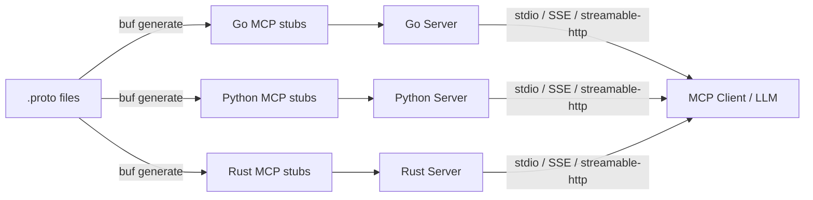
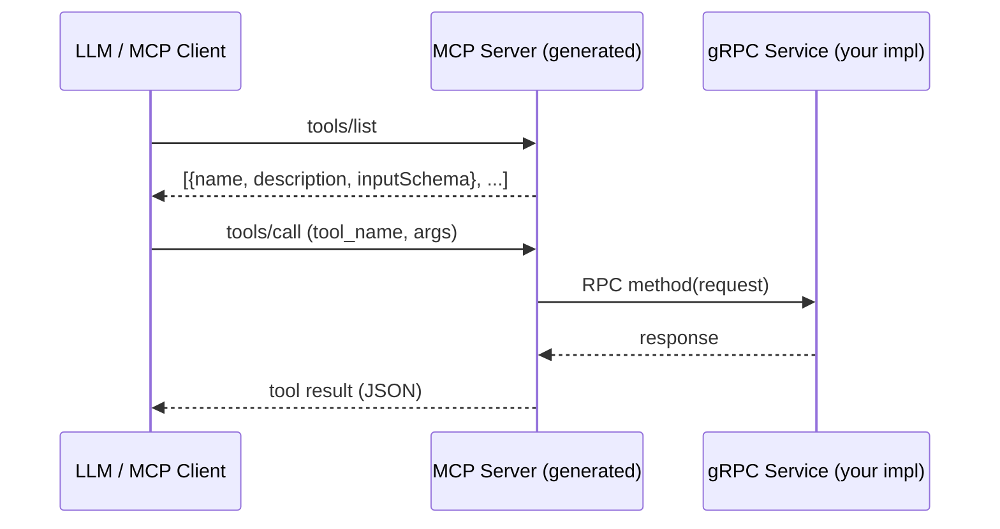
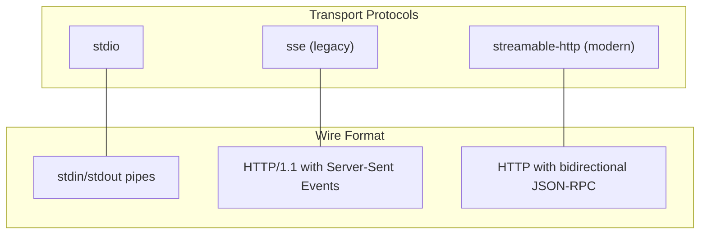
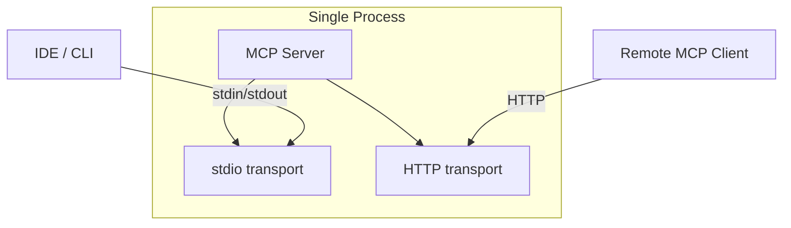
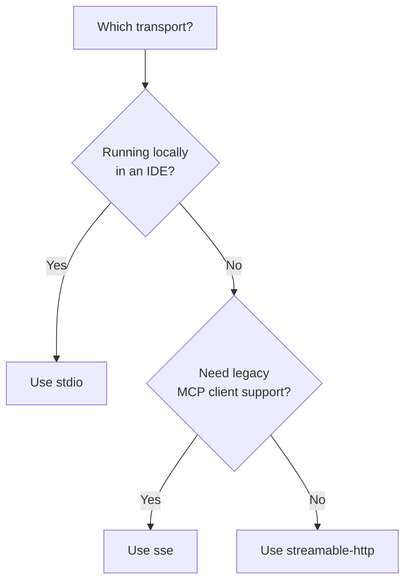
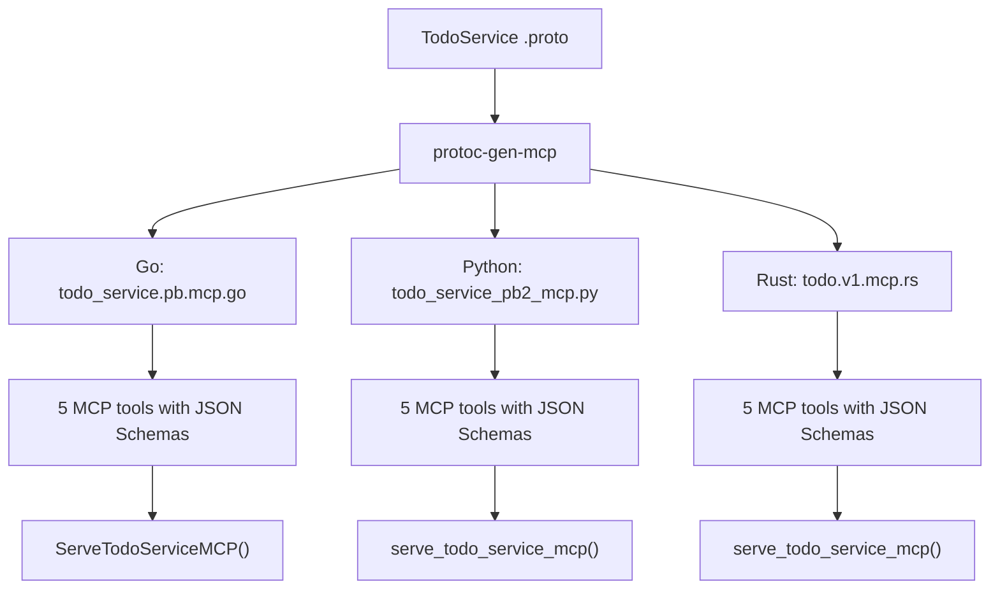

# protoc-mcp-gen

A protoc plugin and runtime library that generates [Model Context Protocol (MCP)](https://modelcontextprotocol.io/) server stubs from Protocol Buffer service definitions. It bridges gRPC services to the MCP ecosystem, enabling LLMs to discover and invoke your gRPC methods as MCP tools.

| Language   | Generated File         | Example                              |
| ---------- | ---------------------- | ------------------------------------ |
| **Go**     | `*_service.pb.mcp.go`  | [`examples/go`](examples/go)         |
| **Python** | `*_service_pb2_mcp.py` | [`examples/python`](examples/python) |
| **Rust**   | `*_service.mcp.rs`     | [`examples/rust`](examples/rust)     |

## Architecture



## How It Works



1. `protoc-gen-mcp` reads your `.proto` service definitions and generates MCP server code.
2. Each unary RPC becomes an MCP tool with a JSON Schema derived from the protobuf request message.
3. The generated serve function starts an MCP server using the configured transport.
4. At runtime, MCP clients discover tools via `tools/list` and invoke them via `tools/call`.

## Project Structure

```
protoc-mcp-gen/
  cmd/
    protoc-gen-mcp/        -- protoc plugin binary (Go, Python, Rust targets)
  pkg/
    generator/             -- code generation logic
      schema.go            -- protobuf-to-JSON-Schema conversion
      schema_wkt.go        -- well-known type schema handlers
      generator.go         -- Go code generator
      python.go            -- Python code generator
      rust.go              -- Rust code generator
      templates/           -- Go text/template files (go.tpl, python.tpl, rust.tpl)
    runtime/               -- Go runtime helpers
      server.go            -- transport-agnostic MCP server launcher
      config.go            -- functional options (transport, addr, extra properties)
      schema.go            -- JSON Schema parsing and tool creation helpers
      error.go             -- gRPC-to-MCP error conversion
  examples/
    proto/                 -- example .proto definitions (TodoService)
    go/                    -- Go example server
    python/                -- Python example server
    rust/                  -- Rust example server
    buf.gen.yaml           -- buf code generation config
```

## Installation

### Prerequisites

- [buf](https://buf.build/) CLI
- Go 1.21+ (for the plugin and Go runtime)
- Python 3.10+ (for Python examples)
- Rust 1.75+ with Cargo (for Rust examples)

### Install the plugin (v1.0.0)

**Go install:**

```bash
go install github.com/machanirobotics/protoc-mcp-gen/cmd/protoc-gen-mcp@v1.0.0
```

**Download binary from [GitHub Releases](https://github.com/machanirobotics/protoc-mcp-gen/releases/tag/v1.0.0):**

Extract the archive and place `protoc-gen-mcp` in your `$PATH`.

**Build from source:**

```bash
go build -o $(go env GOPATH)/bin/protoc-gen-mcp ./cmd/protoc-gen-mcp/
```

## Code Generation

### buf.gen.yaml

The plugin is invoked via `buf generate`. A single `buf.gen.yaml` can generate code for all three languages:

```yaml
version: v2
plugins:
  # --- Go ---
  - local: protoc-gen-go
    out: proto/generated/go
    opt:
      - module=example/proto/generated/go
  - local: protoc-gen-go-grpc
    out: proto/generated/go
    opt:
      - module=example/proto/generated/go
  - local: protoc-gen-mcp
    out: proto/generated/go
    opt:
      - lang=go
      - module=example/proto/generated/go

  # --- Python ---
  - remote: buf.build/protocolbuffers/python
    out: proto/generated/python
  - remote: buf.build/grpc/python
    out: proto/generated/python
  - local: protoc-gen-mcp
    out: proto/generated/python
    opt:
      - lang=python
      - paths=source_relative

  # --- Rust ---
  - remote: buf.build/community/neoeinstein-prost
    out: proto/generated/rust
  - remote: buf.build/community/neoeinstein-tonic
    out: proto/generated/rust
  - local: protoc-gen-mcp
    out: proto/generated/rust
    opt:
      - lang=rust
      - paths=source_relative
```

### Plugin options

| Option           | Values                 | Description                                               |
| ---------------- | ---------------------- | --------------------------------------------------------- |
| `lang`           | `go`, `python`, `rust` | Target language for generated code.                       |
| `package_suffix` | any string (Go only)   | Sub-package suffix for generated `.pb.mcp.go` files.      |
| `paths`          | `source_relative`      | Place output relative to the proto source (Python, Rust). |

### Generate

```bash
cd examples
buf generate
```

This produces:

- **Go**: `*_service.pb.mcp.go` files with `Serve<Service>MCP()` and tool registration.
- **Python**: `*_service_pb2_mcp.py` files with `serve_<service>_mcp()` and handler base classes.
- **Rust**: `*_service.mcp.rs` files with `serve_<service>_mcp()` and handler traits.

## Transport Configuration

The gateway supports three MCP transport protocols. Every generated server accepts a transport setting through environment variables or programmatic configuration.

### Supported transports



| Transport       | Value             | Protocol                      | Default Port | Use Case                            |
| --------------- | ----------------- | ----------------------------- | ------------ | ----------------------------------- |
| stdio           | `stdio`           | stdin/stdout pipes            | N/A          | Local tools, IDE integrations       |
| SSE (legacy)    | `sse`             | HTTP + Server-Sent Events     | 8082         | Browser clients, legacy MCP clients |
| Streamable HTTP | `streamable-http` | HTTP + bidirectional JSON-RPC | 8082         | Production deployments, modern SDKs |

### Multiple transports

All three languages support running multiple transports concurrently in the same process via a **comma-separated** transport string. This is useful when you want a single server to be reachable both locally (stdio) and over the network (HTTP).



Example:

```bash
# Serve both stdio and streamable-http simultaneously
MCP_TRANSPORT=stdio,streamable-http go run .
MCP_TRANSPORT=stdio,streamable-http uv run python main.py
MCP_TRANSPORT=stdio,streamable-http cargo run
```

When combining stdio with an HTTP transport, the HTTP server runs in a background thread/goroutine/task while stdio blocks the main thread. Valid combinations:

| Combination             | Behaviour                            |
| ----------------------- | ------------------------------------ |
| `stdio`                 | stdio only                           |
| `sse`                   | HTTP SSE only                        |
| `streamable-http`       | HTTP Streamable only                 |
| `stdio,streamable-http` | stdio + HTTP Streamable concurrently |
| `stdio,sse`             | stdio + HTTP SSE concurrently        |
| `sse,streamable-http`   | Both HTTP protocols on the same port |

### Environment variables

All three language examples read the same environment variables:

| Variable        | Default   | Description                                                    |
| --------------- | --------- | -------------------------------------------------------------- |
| `MCP_TRANSPORT` | `sse`     | Comma-separated transports: `stdio`, `sse`, `streamable-http`. |
| `MCP_HOST`      | `0.0.0.0` | Bind address for HTTP transports (Python, Rust).               |
| `MCP_PORT`      | `8082`    | Listen port for HTTP transports.                               |
| `MCP_ADDR`      | `:8082`   | Listen address in `host:port` form (Go).                       |
| `GRPC_ADDR`     | `:50051`  | gRPC server listen address (Go).                               |
| `GRPC_PORT`     | `50051`   | gRPC server listen port (Python, Rust).                        |

### Go configuration

The Go runtime uses the `runtime.MCPServerConfig` struct:

```go
import "github.com/machanirobotics/protoc-mcp-gen/pkg/runtime"

cfg := &runtime.MCPServerConfig{
    Name:       "my-service",
    Version:    "1.0.0",
    Transports: []runtime.Transport{runtime.TransportStdio, runtime.TransportStreamableHTTP},
    Addr:       ":8082",
    BasePath:   "/todo/v1/todoservice/mcp",  // auto-derived from proto package if omitted
}

err := todopbv1.ServeTodoServiceMCP(ctx, server, cfg)
```

Switching transports at runtime via environment variable (comma-separated):

```go
transports := runtime.ParseTransports("sse")
if t := os.Getenv("MCP_TRANSPORT"); t != "" {
    transports = runtime.ParseTransports(t)  // e.g. "stdio,streamable-http"
}
cfg.Transports = transports
```

### Python configuration

The generated `serve_<service>_mcp()` function accepts transport parameters directly:

```python
from todo.v1.todo_service_pb2_mcp import serve_todo_service_mcp

serve_todo_service_mcp(
    impl,
    transport="stdio,streamable-http",  # comma-separated for concurrent transports
    host="0.0.0.0",
    port=8082,
)
```

Environment-driven startup:

```bash
MCP_TRANSPORT=streamable-http MCP_PORT=9090 uv run python main.py
```

### Rust configuration

The generated code provides a `TodoServiceMcpTransportConfig` struct:

```rust
use todo_service_mcp::{serve_todo_service_mcp, TodoServiceMcpTransportConfig};

let config = TodoServiceMcpTransportConfig {
    transport: "stdio,streamable-http".into(),  // comma-separated for concurrent transports
    host: "0.0.0.0".into(),
    port: 8082,
    ..Default::default()
};

serve_todo_service_mcp(server, config).await?;
```

Environment-driven startup:

```bash
MCP_TRANSPORT=streamable-http MCP_PORT=9090 cargo run
```

## Transport Selection Guide



- **stdio** -- Best for local development, IDE integrations (e.g., Claude Desktop), and testing via pipes. No network port required.
- **sse** -- Supported by all MCP client versions. Uses HTTP/1.1 with Server-Sent Events for server-to-client streaming. Good default for broad compatibility.
- **streamable-http** -- The modern MCP transport. Supports bidirectional communication over standard HTTP. Recommended for production deployments and newer MCP SDKs.

## Running the Examples

### Go

```bash
cd examples/go

# Default: gRPC on :50051, MCP SSE on :8082
go run .

# Switch to streamable-http transport
MCP_TRANSPORT=streamable-http go run .

# Use stdio transport (no HTTP, reads from stdin)
MCP_TRANSPORT=stdio go run .
```

### Python

```bash
cd examples/python

# Default: gRPC on :50051, MCP SSE on :8082
uv run python main.py

# Switch to streamable-http
MCP_TRANSPORT=streamable-http uv run python main.py

# Custom port
MCP_PORT=9090 uv run python main.py
```

### Rust

```bash
cd examples/rust

# Default: gRPC on :50051, MCP SSE on :8082
cargo run

# Switch to streamable-http
MCP_TRANSPORT=streamable-http cargo run

# Custom host and port
MCP_HOST=127.0.0.1 MCP_PORT=9090 cargo run
```

## Generated Code Overview

For a proto service like:

```protobuf
service TodoService {
  rpc CreateTodo(CreateTodoRequest) returns (Todo);
  rpc GetTodo(GetTodoRequest) returns (Todo);
  rpc ListTodos(ListTodosRequest) returns (ListTodosResponse);
  rpc UpdateTodo(UpdateTodoRequest) returns (Todo);
  rpc DeleteTodo(DeleteTodoRequest) returns (google.protobuf.Empty);
}
```

The plugin generates:



Each RPC becomes an MCP tool named `<package>_<Service>_<Method>` (e.g., `todo_v1_TodoService_CreateTodo`). The tool's `inputSchema` is a JSON Schema derived from the protobuf request message, including:

- Field types mapped to JSON Schema types.
- `google.api.field_behavior` REQUIRED annotations mapped to JSON Schema `required`.
- `buf.validate` constraints mapped to `minLength`, `maxLength`, `pattern`, `minimum`, `maximum`, etc.
- Well-known types (Timestamp, Duration, FieldMask, Struct, Any, wrapper types) mapped to appropriate JSON Schema representations.
- Protobuf `oneof` groups mapped to JSON Schema `oneOf`/`anyOf`.

## Supported Languages

| Language   | Generated File Pattern | Example                              | Entry Point                |
| ---------- | ---------------------- | ------------------------------------ | -------------------------- |
| **Go**     | `*_service.pb.mcp.go`  | [`examples/go`](examples/go)         | `ServeTodoServiceMCP()`    |
| **Python** | `*_service_pb2_mcp.py` | [`examples/python`](examples/python) | `serve_todo_service_mcp()` |
| **Rust**   | `*_service.mcp.rs`     | [`examples/rust`](examples/rust)     | `serve_todo_service_mcp()` |

Each example implements the same `TodoService` gRPC service and exposes it as MCP tools. See the individual example directories for complete, runnable code.

## License

Licensed under the [Apache License, Version 2.0](LICENSE).
