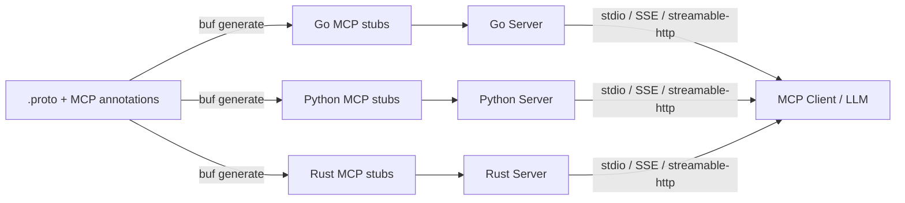

# grpc-mcp-gateway

[](https://go.dev/)
[](https://buf.build/machanirobotics/grpc-mcp-gateway)
[](LICENSE)

A protoc plugin and runtime that generates [Model Context Protocol (MCP)](https://modelcontextprotocol.io/) servers from Protocol Buffer service definitions. Expose any gRPC service to LLMs — with tools, prompts, resources, and elicitation — in Go, Python, and Rust.

## Features

- **Multi-language** — Generate MCP server code for Go, Python, and Rust from a single `.proto` file
- **Tools** — Every unary RPC becomes an MCP tool with a JSON Schema derived from the protobuf request message
- **Prompts** — Attach prompt templates to RPCs with schema-validated arguments via `(mcp.protobuf.prompt)`
- **Resources** — Auto-detect MCP resources from `google.api.resource` annotations
- **Elicitation** — Generate confirmation dialogs before tool execution via `(mcp.protobuf.elicitation)`
- **Transports** — stdio, SSE, and streamable-http — run multiple concurrently in a single process
- **gRPC Gateway** — Forward MCP tool calls to a remote gRPC server (Go)
- **Published Protos** — Import annotations directly from [`buf.build/machanirobotics/grpc-mcp-gateway`](https://buf.build/machanirobotics/grpc-mcp-gateway)

| Language   | Generated File         | Example                              |
| ---------- | ---------------------- | ------------------------------------ |
| **Go**     | `*_service.pb.mcp.go`  | [`examples/go`](examples/go)         |
| **Python** | `*_service_pb2_mcp.py` | [`examples/python`](examples/python) |
| **Rust**   | `*_service.mcp.rs`     | [`examples/rust`](examples/rust)     |

## Architecture



## How It Works


1. **Annotate** your `.proto` services with MCP options (tools, prompts, resources, elicitation).
2. **Generate** MCP server code with `buf generate` using `protoc-gen-mcp`.
3. **Implement** your gRPC service logic as usual.
4. **Serve** — the generated code starts an MCP server on your chosen transport(s).
5. **Connect** — MCP clients (Claude Desktop, MCP Inspector, custom LLM agents) discover and invoke your tools.

## Quick Start

### 1. Install the plugin

```bash
go install github.com/machanirobotics/grpc-mcp-gateway/plugin/cmd/protoc-gen-mcp@latest
```

Or download a binary from [GitHub Releases](https://github.com/machanirobotics/grpc-mcp-gateway/releases).

### 2. Add the proto dependency

```yaml
# buf.yaml
version: v2
deps:
  - buf.build/googleapis/googleapis
  - buf.build/machanirobotics/grpc-mcp-gateway
```

```bash
buf dep update
```

### 3. Annotate your proto

```protobuf
syntax = "proto3";
package todo.v1;

import "mcp/protobuf/annotations.proto";

service TodoService {
  option (mcp.protobuf.service) = {
    app: {
      name: "Todo App"
      version: "1.0.0"
      description: "A simple todo management application"
    }
  };

  rpc CreateTodo(CreateTodoRequest) returns (Todo) {
    option (mcp.protobuf.tool) = {
      description: "Creates a new todo item."
    };
    option (mcp.protobuf.elicitation) = {
      message: "Please confirm the todo details before creating."
      schema: "todo.v1.CreateTodoConfirmation"
    };
  }

  rpc GetTodo(GetTodoRequest) returns (Todo) {
    option (mcp.protobuf.tool) = {
      description: "Retrieves a todo by resource name."
    };
    option (mcp.protobuf.prompt) = {
      name: "summarize_todos"
      description: "Summarize all pending todo items for a user"
      schema: "todo.v1.SummarizeTodosArgs"
    };
  }
}
```

### 4. Generate code

```yaml
# buf.gen.yaml
version: v2
plugins:
  # --- Go ---
  - local: protoc-gen-go
    out: generated/go
    opt: [module=example/generated/go]
  - local: protoc-gen-mcp
    out: generated/go
    opt: [lang=go, module=example/generated/go]

  # --- Python ---
  - remote: buf.build/protocolbuffers/python
    out: generated/python
  - local: protoc-gen-mcp
    out: generated/python
    opt: [lang=python, paths=source_relative]

  # --- Rust ---
  - remote: buf.build/community/neoeinstein-prost
    out: generated/rust
  - local: protoc-gen-mcp
    out: generated/rust
    opt: [lang=rust, paths=source_relative]
```

```bash
buf generate
```

### 5. Run with MCP Inspector

```bash
# Go
cd examples/go/stdio && go run .
npx @modelcontextprotocol/inspector -- go run .

# Python
cd examples/python
npx @modelcontextprotocol/inspector -- uv run python stdio/main.py

# Rust
cd examples/rust && cargo build --bin stdio
npx @modelcontextprotocol/inspector -- ./target/debug/stdio
```

## MCP Annotations

All annotations are imported from `mcp/protobuf/annotations.proto` ([BSR](https://buf.build/machanirobotics/grpc-mcp-gateway)).

### Service-level: `mcp.protobuf.service`

Defines app metadata for the MCP server:

```protobuf
option (mcp.protobuf.service) = {
  app: { name: "My App" version: "1.0.0" description: "..." }
};
```

### Tool: `mcp.protobuf.tool`

Override auto-generated tool name or description:

```protobuf
rpc CreateItem(CreateItemRequest) returns (Item) {
  option (mcp.protobuf.tool) = {
    name: "custom_tool_name"
    description: "Custom description for LLMs."
  };
}
```

### Prompt: `mcp.protobuf.prompt`

Attach a prompt template to an RPC. The `schema` references a proto message whose fields become prompt arguments:

```protobuf
rpc GetItem(GetItemRequest) returns (Item) {
  option (mcp.protobuf.prompt) = {
    name: "summarize_items"
    description: "Summarize all items"
    schema: "mypackage.SummarizeItemsArgs"
  };
}
```

### Elicitation: `mcp.protobuf.elicitation`

Request user confirmation before executing a tool. The `schema` references a proto message whose fields become the confirmation form:

```protobuf
rpc DeleteItem(DeleteItemRequest) returns (google.protobuf.Empty) {
  option (mcp.protobuf.elicitation) = {
    message: "Are you sure you want to delete this item?"
    schema: "mypackage.DeleteConfirmation"
  };
}
```

Elicitation is supported in all three languages with graceful degradation — if the client doesn't support elicitation, the tool proceeds without confirmation.

### Resources

Resources are auto-detected from `google.api.resource` annotations on proto messages. No additional MCP annotation is needed.

## Project Structure

```
grpc-mcp-gateway/
├── proto/                          # Publishable buf module (BSR)
│   └── mcp/protobuf/              # MCP annotation .proto files
├── internal/mcp/protobuf/         # Generated .pb.go (internal)
├── runtime/                       # Go runtime (server, config, schema helpers)
├── plugin/
│   ├── cmd/protoc-gen-mcp/        # Plugin binary
│   └── generator/                 # Code generation (Go, Python, Rust)
│       └── templates/             # go.tpl, python.tpl, rust.tpl
├── examples/
│   ├── proto/                     # TodoService definition
│   ├── go/                        # Go examples (http, stdio, sse, grpc-gateway)
│   ├── python/                    # Python examples (http, stdio, sse)
│   └── rust/                      # Rust examples (http, stdio, sse)
├── go.work                        # Multi-module workspace
└── .github/workflows/             # CI + release pipelines
```

## Plugin Options

| Option           | Values                 | Description                                              |
| ---------------- | ---------------------- | -------------------------------------------------------- |
| `lang`           | `go`, `python`, `rust` | Target language for generated code                       |
| `module`         | Go module path         | Go module prefix for output path resolution              |
| `package_suffix` | any string (Go only)   | Sub-package suffix for generated `.pb.mcp.go` files      |
| `paths`          | `source_relative`      | Place output relative to the proto source (Python, Rust) |

## Generated Code

For each proto service, the plugin generates:

| Feature             | Go                                                  | Python                                 | Rust                              |
| ------------------- | --------------------------------------------------- | -------------------------------------- | --------------------------------- |
| **Tools** (per RPC) | `s.AddTool(...)`                                    | `@server.call_tool()`                  | `ServerHandler::call_tool()`      |
| **Prompts**         | `s.AddPrompt(...)`                                  | `@server.get_prompt()`                 | `ServerHandler::get_prompt()`     |
| **Resources**       | `s.AddResource(...)` / `s.AddResourceTemplate(...)` | `@server.list_resources()`             | `ServerHandler::list_resources()` |
| **Elicitation**     | `runtime.RunElicitation(...)`                       | `session.elicit(...)`                  | `peer.create_elicitation(...)`    |
| **Serve function**  | `ServeTodoServiceMCP()`                             | `serve_todo_service_mcp()`             | `serve_todo_service_mcp()`        |
| **gRPC forwarding** | `ForwardToTodoServiceMCPClient()`                   | `forward_to_todo_service_mcp_client()` | —                                 |
| **Interface/trait** | `TodoServiceMCPServer`                              | `TodoServiceMCPServer` (Protocol)      | `TodoServiceMcpServer` (trait)    |

### JSON Schema derivation

The tool's `inputSchema` is derived from the protobuf request message:

- Field types → JSON Schema types
- `google.api.field_behavior` REQUIRED → JSON Schema `required`
- `buf.validate` constraints → `minLength`, `maxLength`, `pattern`, `minimum`, `maximum`, etc.
- Well-known types (Timestamp, Duration, FieldMask, Struct, Any, wrappers) → appropriate JSON Schema
- Protobuf `oneof` → JSON Schema `oneOf`/`anyOf`
- Enums → JSON Schema `enum` with string values

## Transport Configuration

### Supported transports

| Transport       | Value             | Protocol                      | Use Case                            |
| --------------- | ----------------- | ----------------------------- | ----------------------------------- |
| stdio           | `stdio`           | stdin/stdout pipes            | Local tools, IDE integrations       |
| SSE (legacy)    | `sse`             | HTTP + Server-Sent Events     | Browser clients, legacy MCP clients |
| Streamable HTTP | `streamable-http` | HTTP + bidirectional JSON-RPC | Production deployments, modern SDKs |

### Multiple transports

Run multiple transports concurrently with comma-separated values:

```bash
MCP_TRANSPORT=stdio,streamable-http go run .
MCP_TRANSPORT=stdio,streamable-http uv run python http/main.py
MCP_TRANSPORT=stdio,streamable-http cargo run --bin http
```

### Environment variables

| Variable        | Default     | Description                                        |
| --------------- | ----------- | -------------------------------------------------- |
| `MCP_TRANSPORT` | per-example | Comma-separated: `stdio`, `sse`, `streamable-http` |
| `MCP_HOST`      | `0.0.0.0`   | Bind address for HTTP transports                   |
| `MCP_PORT`      | `8082`      | Listen port for HTTP transports                    |
| `GRPC_PORT`     | `50051`     | gRPC server listen port                            |

### Go runtime configuration

```go
import "github.com/machanirobotics/grpc-mcp-gateway/runtime"

cfg := &runtime.MCPServerConfig{
    Name:       "my-service",
    Version:    "1.0.0",
    Transports: []runtime.Transport{runtime.TransportStdio, runtime.TransportStreamableHTTP},
    Addr:       ":8082",
    BasePath:   "/todo/v1/todoservice/mcp",
}

todopbv1.ServeTodoServiceMCP(ctx, server, cfg)
```

### Python configuration

```python
from todo.v1.todo_service_pb2_mcp import serve_todo_service_mcp

serve_todo_service_mcp(impl, transport="streamable-http", host="0.0.0.0", port=8082)
```

### Rust configuration

```rust
let config = TodoServiceMcpTransportConfig {
    transport: "streamable-http".into(),
    host: "0.0.0.0".into(),
    port: 8082,
    ..Default::default()
};
serve_todo_service_mcp(server, config).await?;
```

## Examples

The [`examples/`](examples/) directory contains a complete TodoService implementation in all three languages, demonstrating tools, prompts, resources, and elicitation.

| Language | Directory                             | Transports                     | Test                                    |
| -------- | ------------------------------------- | ------------------------------ | --------------------------------------- |
| Go       | [`examples/go/`](examples/go)         | http, stdio, sse, grpc-gateway | `go test ./examples/go/http/`           |
| Python   | [`examples/python/`](examples/python) | http, stdio, sse               | `uv run python -m pytest smoke_test.py` |
| Rust     | [`examples/rust/`](examples/rust)     | http, stdio, sse               | `cargo check`                           |

See each language's README for detailed setup and run instructions.

## Testing with MCP Inspector

```bash
# stdio (Inspector spawns the process)
npx @modelcontextprotocol/inspector -- <command>

# HTTP (start server first, then open Inspector)
npx @modelcontextprotocol/inspector
# Enter URL: http://localhost:8082/todo/v1/todoservice/mcp
```

## License

Licensed under the [Apache License, Version 2.0](LICENSE).
