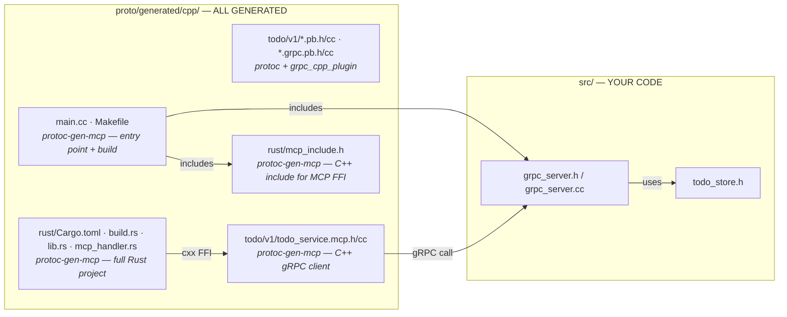
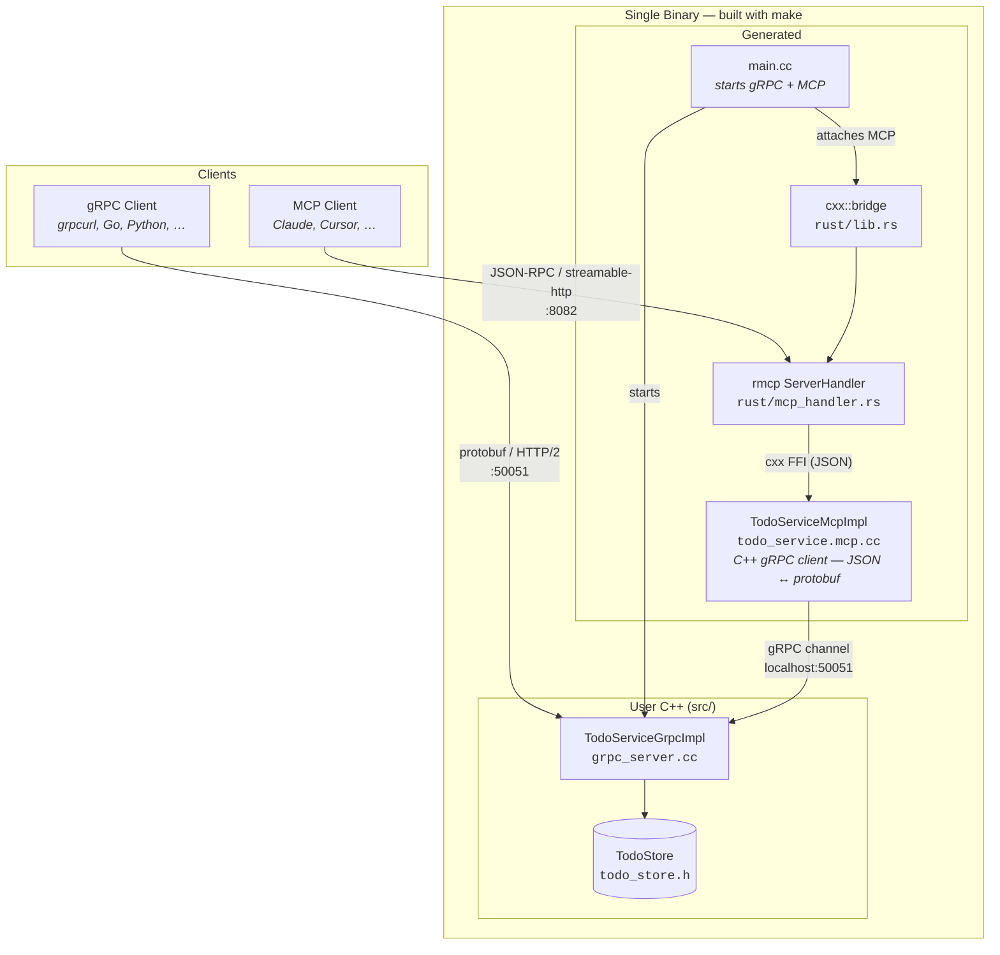
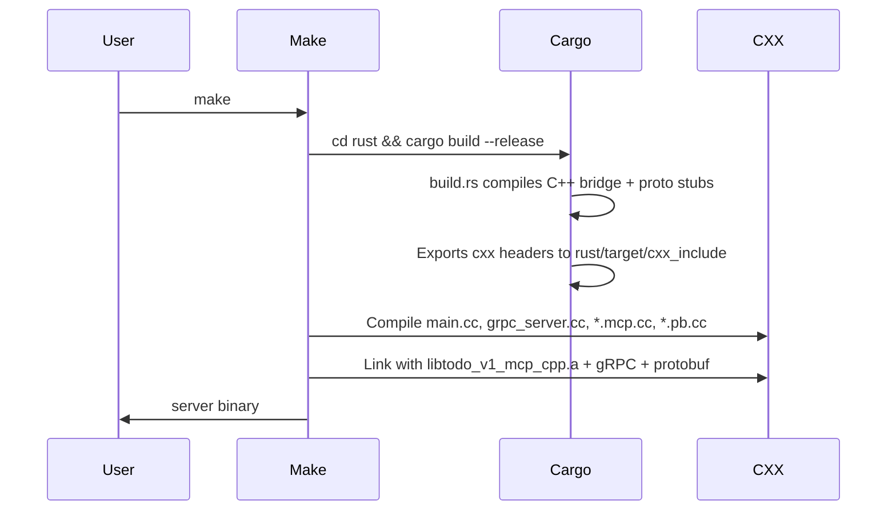
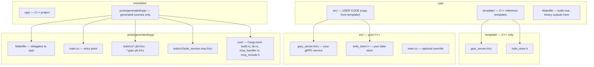

# Attach MCP to an Existing C++ gRPC Server

This is a **C++ project** built with **Make**. The developer writes pure C++ (gRPC server, business logic). The MCP protocol layer is generated by `protoc-gen-mcp`, which produces the entire Rust project, C++ adapter, and Makefile. You run `make` to build.

## What the Developer Writes vs. What Is Generated



## Architecture



## Build Flow



## Build & Run

```bash
# Prerequisites (macOS)
brew install grpc protobuf

# Regenerate (from examples/)
buf generate --path proto/todo

# First time: copy C++ templates to src/
cp template/grpc_server.h template/grpc_server.cc template/todo_store.h src/

# Build (from cpp/)
make

# Run — gRPC on :50051, MCP on :8082
# Server binary is at cpp/server (built in cpp/)
./server

# Run — stdio transport (for MCP Inspector)
MCP_TRANSPORT=stdio ./server

# Run with MCP Inspector
MCP_TRANSPORT=stdio npx @modelcontextprotocol/inspector -- ./server
```

## Troubleshooting

**"MCP HTTP server failed" / "Address already in use"** — Port 8082 is already in use (e.g. another server instance). Either:

- Kill the process: `lsof -i :8082` then `kill <PID>`
- Use a different port: `MCP_PORT=8083 ./server`

## Environment Variables

| Variable        | Default                    | Description                |
| --------------- | -------------------------- | -------------------------- |
| `GRPC_ADDR`     | `[::]:50051`               | gRPC server listen address |
| `MCP_TRANSPORT` | `http`                     | `http` or `stdio`          |
| `MCP_HOST`      | `0.0.0.0`                  | MCP HTTP bind address      |
| `MCP_PORT`      | `8082`                     | MCP HTTP port              |
| `MCP_BASE_PATH` | `/todo/v1/todoservice/mcp` | MCP HTTP base path         |

## Project Layout



| Path                                     | What                                                                             | Who writes it      |
| ---------------------------------------- | -------------------------------------------------------------------------------- | ------------------ |
| `template/`                              | Reference C++ templates. Copy to `src/` to start.                                | **Reference**      |
| `src/grpc_server.h/cc`                   | Your gRPC service. Pure C++, zero FFI.                                           | **You**            |
| `src/todo_store.h`                       | Your data store.                                                                 | **You**            |
| `src/main.cc`                            | Optional. If present, overrides generated `main.cc`.                             | **You** (optional) |
| `proto/generated/cpp/main.cc`            | C++ entry point. Starts gRPC, attaches MCP.                                      | `protoc-gen-mcp`   |
| `proto/generated/cpp/Makefile`           | Delegates to cpp/.                                                               | `protoc-gen-mcp`   |
| `cpp/Makefile`                           | Build root. Invokes cargo, compiles C++, links. Binary → cpp/server              | **Project**        |
| `proto/generated/cpp/rust/*`             | Full Rust project (Cargo.toml, build.rs, lib.rs, mcp_handler.rs, mcp_include.h). | `protoc-gen-mcp`   |
| `proto/generated/cpp/todo/v1/*.mcp.h/cc` | C++ gRPC-client adapter. JSON ↔ protobuf.                                        | `protoc-gen-mcp`   |

## Customizing main.cc

The generated `main.cc` reads env vars and starts gRPC + MCP. To customize, copy it to `src/main.cc` and edit. The Makefile uses `src/main.cc` if it exists, otherwise `proto/generated/cpp/main.cc`.
